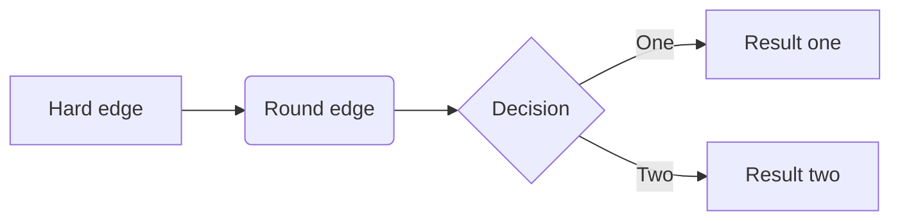
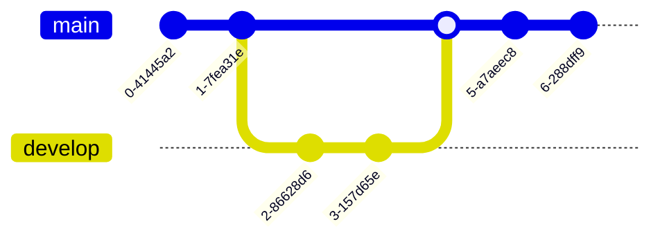
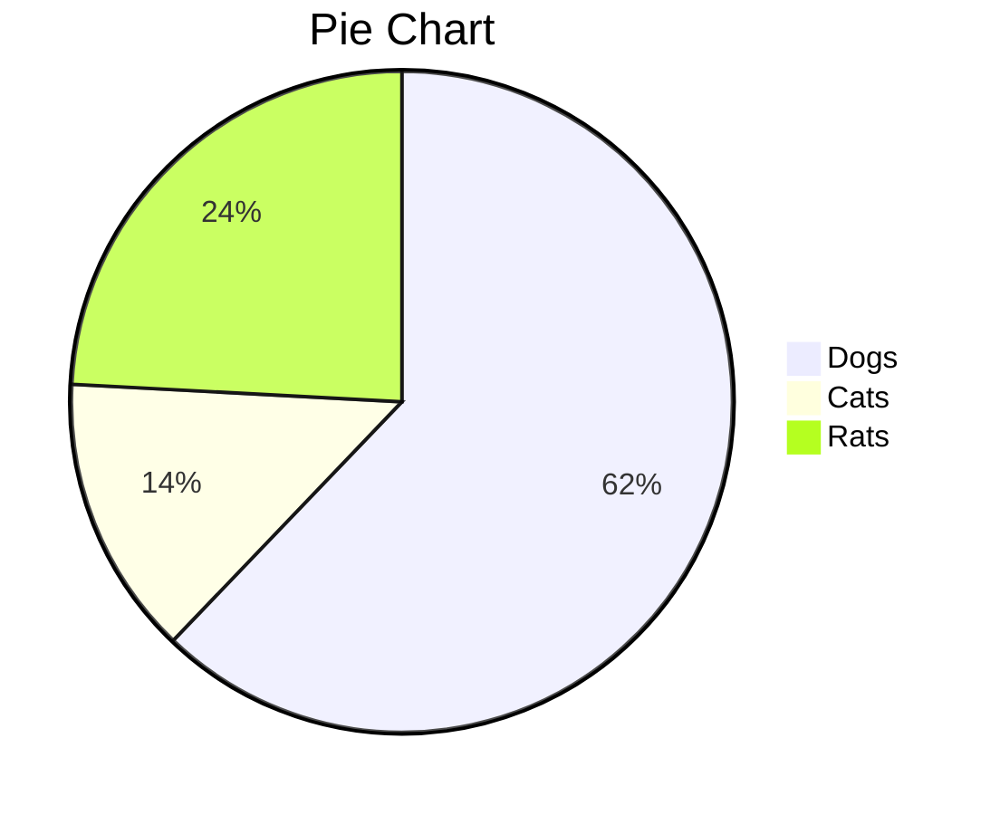
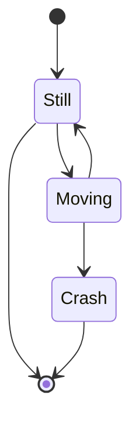

# Ascii-Art-Diagram

ASCI art characters for creating diagrams

## Characters:

### Single line

* ASCII code 191 = ┐ ( Box drawing character single line upper right corner )
* ASCII code 192 = └ ( Box drawing character single line lower left corner )
* ASCII code 193 = ┴ ( Box drawing character single line horizontal and up )
* ASCII code 194 = ┬ ( Box drawing character single line horizontal down )
* ASCII code 195 = ├ ( Box drawing character single line vertical and right )
* ASCII code 196 = ─ ( Box drawing character single horizontal line )
* ASCII code 197 = ┼ ( Box drawing character single line horizontal vertical )
* ASCII code 217 = ┘ ( Box drawing character single line lower right corner )
* ASCII code 218 = ┌ ( Box drawing character single line upper left corner )
* ASCII code 179 = │ ( Box drawing character single vertical line )
* ASCII code 180 = ┤ ( Box drawing character single vertical and left line )

### Double line

* ASCII code 185 = ╣ ( Box drawing character double line vertical and left )
* ASCII code 186 = ║ ( Box drawing character double vertical line )
* ASCII code 187 = ╗ ( Box drawing character double line upper right corner )
* ASCII code 188 = ╝ ( Box drawing character double line lower right corner )
* ASCII code 200 = ╚ ( Box drawing character double line lower left corner )
* ASCII code 201 = ╔ ( Box drawing character double line upper left corner )
* ASCII code 202 = ╩ ( Box drawing character double line horizontal and up )
* ASCII code 203 = ╦ ( Box drawing character double line horizontal down )
* ASCII code 204 = ╠ ( Box drawing character double line vertical and right )
* ASCII code 205 = ═ ( Box drawing character double horizontal line )
* ASCII code 206 = ╬ ( Box drawing character double line horizontal vertical )

### Shading

* ASCII code 176 = ░ ( Graphic character, low density dotted )
* ASCII code 177 = ▒ ( Graphic character, medium density dotted )
* ASCII code 178 = ▓ ( Graphic character, high density dotted )
* ASCII code 219 = █ ( Block, graphic character )
* ASCII code 220 = ▄ ( Bottom half block )
* ASCII code 223 = ▀ ( Top half block )
* ASCII code 254 = ■ ( black square )

### Boxes

```
┌───┐
│   │
└───┘

┌───┐  ┌───┐
│   ├──┤   │
└───┘  └───┘

┌───┐
│   │
└─┬─┘
  │
┌─┴─┐
│   │
└───┘

```

# Not-Ascii
- https://support.typora.io/Draw-Diagrams-With-Markdown/

### Sequence Diagrams
This feature uses js-sequence, which turns the following code block into a rendered diagram:

```sequence
Alice->Bob: Hello Bob, how are you?
Note right of Bob: Bob thinks
Bob-->Alice: I am good thanks!
```

### Flowcharts
This feature uses flowchart.js, which turns the following code block into a rendered diagram:

```flow
st=>start: Start
op=>operation: Your Operation
cond=>condition: Yes or No?
e=>end

st->op->cond
cond(yes)->e
cond(no)->op
```

### Flowcharts


### Gitgraph Diagrams / Commit Flow



### Pie Charts



### State Diagrams


